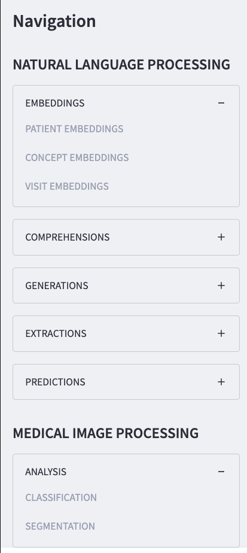

# LitEHRA
Lightning Serve for EHR Analytics

```
lightning run app home.py
```


Supported tasks
```
tasks
├── medical_image_processing
│   └── analysis
│       ├── [ ] classification
│       └── [ ] segmentation
└── natural_language_processing
    ├── comprehensions
    │   ├── [ ] computational_phenotyping
    │   ├── [ ] intepretation
    │   ├── [ ] medical_dialogues
    │   ├── [ ] multilinguality
    │   ├── [ ] patient_recruitment
    │   └── [ ] public_health_applications
    ├── embeddings
    │   ├── [ ] concept_embeddings
    │   ├── [ ] patient_embeddings
    │   └── [ ] visit_embeddings
    ├── extractions
    │   ├── [ ] event_extraction
    │   ├── [ ] medication_extraction
    │   ├── [ ] named_entity_linkage
    │   ├── [ ] named_entity_recognition
    │   ├── [ ] question_answering
    │   └── [ ] relation_extraction
    ├── generations
    │   ├── [ ] document_abstractive_summarization
    │   ├── [ ] document_extractive_summarization
    │   ├── [ ] document_synthesis
    │   └── [ ] medical_language_translation
    └── predictions
        ├── [ ] deidentification
        ├── [ ] medical_coding
        ├── [ ] medical_outcome_prediction
        ├── [ ] medical_text_classification
        ├── [ ] medical_text_segmentation
        └── [ ] word_sense_disambiguation
```


